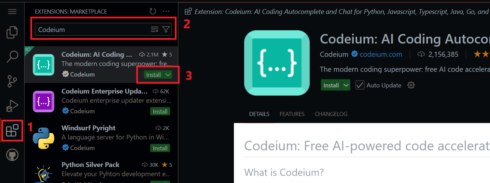
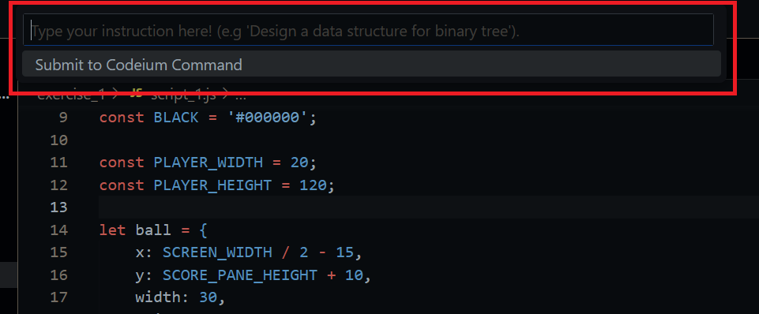
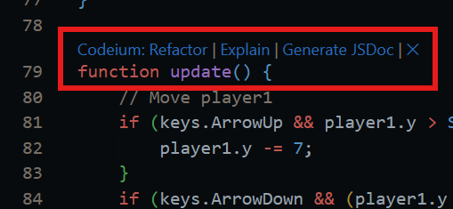

# Code Copilot Workshop

Welcome to the Code Copilot Workshop! This repository contains a series of exercises designed to provide hands-on experience with code copilot tools. Participants will work through various scenarios that demonstrate the power and potential of AI-based code assistance in software development.

## Table of Contents

- [Code Copilot Workshop](#code-copilot-workshop)
  - [Table of Contents](#table-of-contents)
  - [Introduction](#introduction)
  - [Prerequisites](#prerequisites)
  - [Setup](#setup)
  - [Workshop Structure](#workshop-structure)
    - [Modules](#modules)
  - [Exercises](#exercises)

## Introduction

Code copilot tools use machine learning to help developers write code more efficiently by providing intelligent code suggestions, completions, and even entire functions or blocks of code. This workshop aims to familiarize you with these tools, helping you integrate them into your development workflow and improve your productivity.

## Prerequisites

Before starting the workshop, please ensure you have the following:

- A GitHub account

## Setup

1. **Create a Codeium User Account**
    - [Create a user](https://codeium.com/account/register) (it's free).

2. **Open Github Codespace**
    - Create and open a codespace (you must sign in to be able to see the option):

    

3. **Install Codeium's VS Code Extension**
    1. Install Codeium's VS Code extension in the created codespace:
    
    2. You will need to authenticate the extension once the installation is complete:
        - VS Code will prompt you to open a link to Codeium's website. Click "Open".
        - Codeium's website will prompt you to open a link to VS Code. Click "Open".
        - Follow [Codeium's VS Code instructions](https://codeium.com/vscode_tutorial?extensionName=vscode) if you want a detailed guide or if you run in to problems.

4. **Check that Codeium works**

    Check that Codium works by:

    1. Open or create a python file (or any other programming language file).
    2. Check that you have the Codeium symbol in the bottom right corner:

    

    3. Put the cursor anywhere in the file and press "ctrl + i" (for some it might be "ctrl + shift + i") at the same time and check that this pops up at the top of the screen:

    

    4. Check that you can get auto-complete suggestions by writing the following in a .js file (wait after you have written "function "):

    

    Should give you some "ghost text" after a short period of time, something like this:

    

    5. Functions should get a small row above them with Codeium actions like this:

    

## Workshop Structure

The workshop is divided into modules, each focusing on different aspects and capabilities of code copilot tools. Each module contains an exercise that progressively increase in complexity.

### Modules

- **Module 1: Code explanation** - Get familiar with using Chat and Explain.
- **Module 2: Generate docs** - Create function documentation using copilot.
- **Module 3: Generate tests** - Create tests using copilot.
- **Module 4: Code Refactoring** - Improve and optimize existing code with copilot.
- **Module 5: Add more functionality** - Get started with autocomplete, Command, and Chat.
- **Module 6: Debugging Assistance** - Use copilot to help find and fix bugs.

## Exercises

Each module contains an exercise. To make the most out of the workshop, follow these steps for each exercise:

1. Use the code in the corresponding exercise directory.
2. Read the instructions to understand the task.
3. Use the copilot tool to help complete the exercise.

